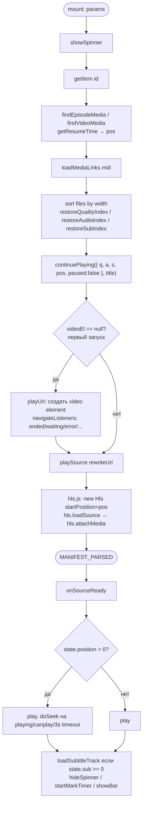
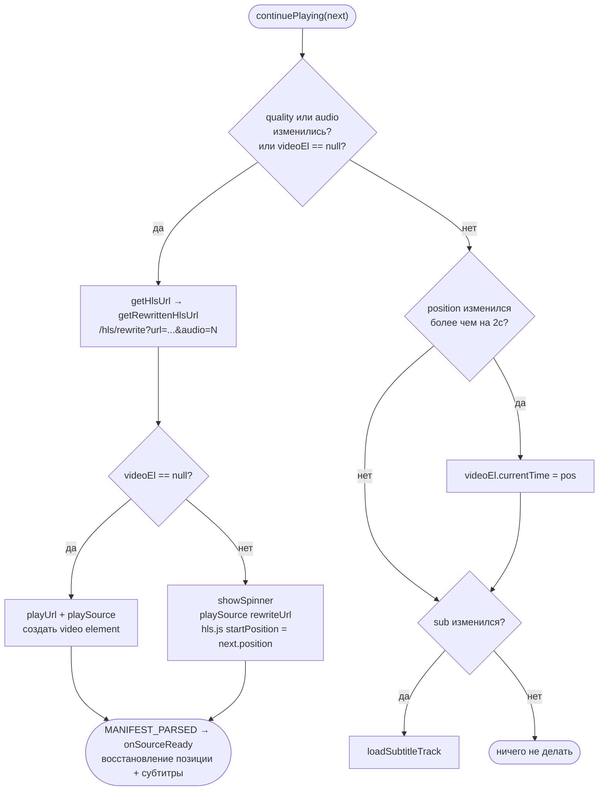
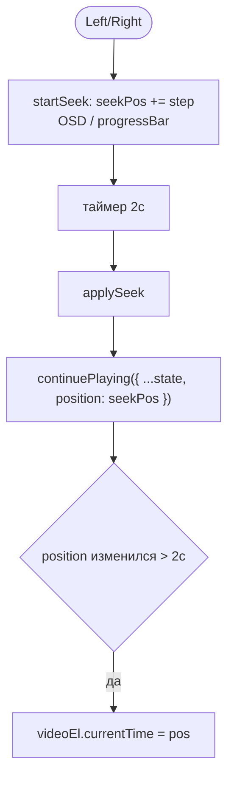
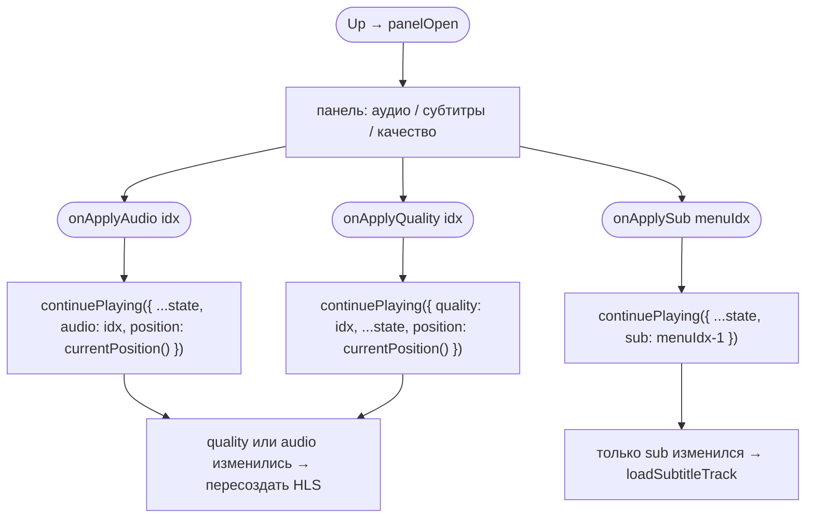
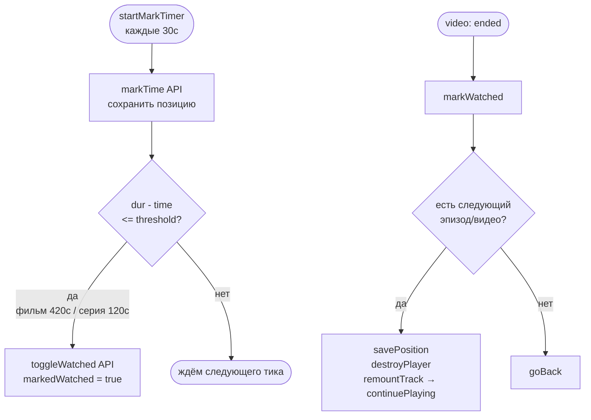
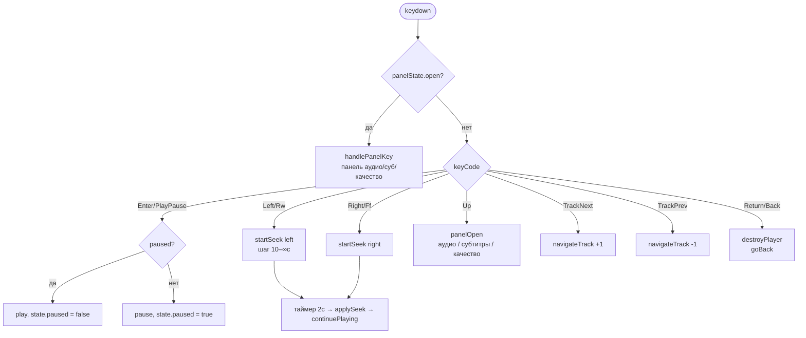

# Player Flow

## Состояние плеера

Всё состояние воспроизведения хранится в одном объекте `PlayState`:

```ts
interface PlayState {
  quality: number;   // индекс в currentFiles
  audio: number;     // индекс в currentAudios
  sub: number;       // индекс в currentSubs (-1 = выкл)
  position: number;  // секунды
  paused: boolean;
}
```

Единый метод `continuePlaying(next, title?)` сравнивает `next` с текущим `state`
и выполняет минимально необходимое действие.

## Запуск воспроизведения



## continuePlaying — единая точка входа



## Выбор HLS URL

```mermaid
flowchart TD
    A([getHlsUrl file]) --> B{isLegacyTizen?}
    B -- да --> C[hls2 всегда]
    B -- нет --> D{streamingType?}
    D -- hls4 --> E[hls4]
    D -- hls2 --> F[hls2]
    D -- hls / auto --> G[hls4 || hls2]
```

## Перемотка



## Панель: аудио / субтитры / качество



## Прогресс и маркировка просмотра



## Управление с пульта



## Завершение / уничтожение


