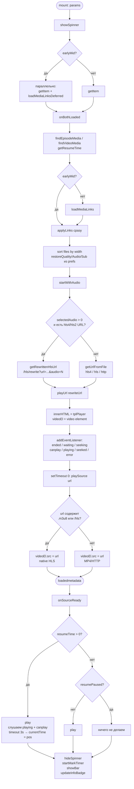
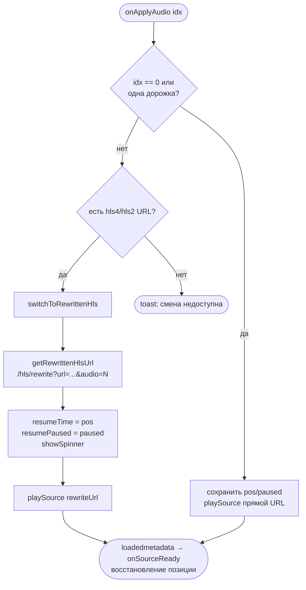
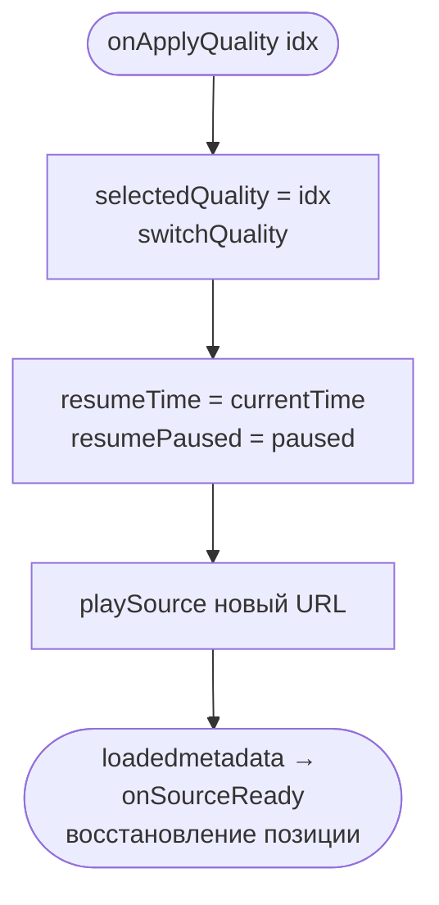
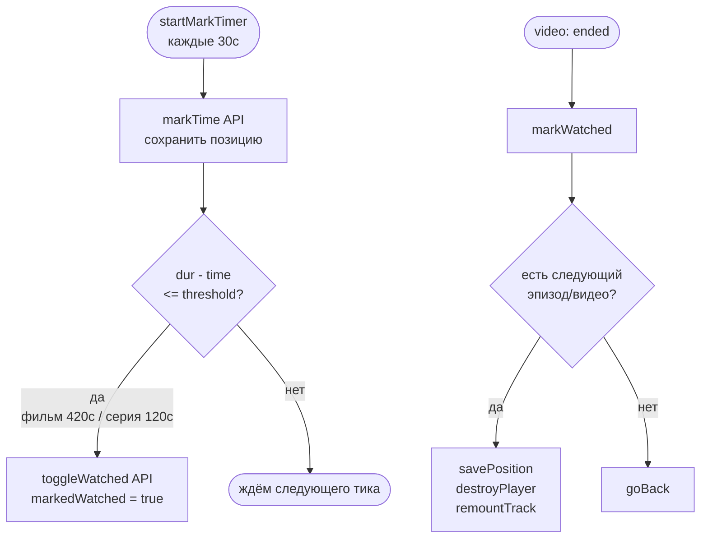
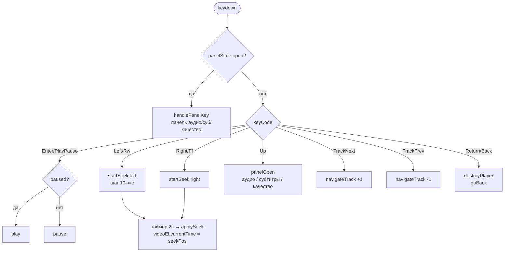
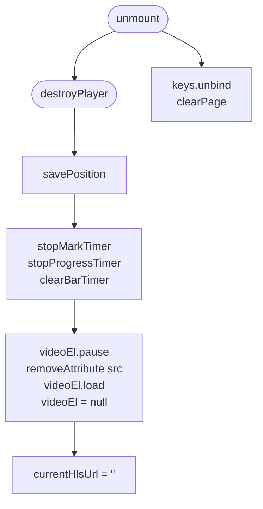

# Player Flow

## Запуск и воспроизведение

```mermaid
flowchart TD
    A([mount: params]) --> B[showSpinner]
    B --> C{earlyMid?}
    C -- да --> D[параллельно:\ngetItem + loadMediaLinksDeferred]
    C -- нет --> E[getItem]
    D --> F[onBothLoaded]
    E --> F

    F --> G[findEpisodeMedia / findVideoMedia\ngetResumeTime]
    G --> H{earlyMid?}
    H -- да --> I[applyLinks сразу]
    H -- нет --> J[loadMediaLinks]
    J --> I

    I --> K[sort files by width\nrestoreQuality/Audio/Sub из prefs]
    K --> L[startWithAudio]

    L --> M{selectedAudio > 0\nи есть hls4/hls2 URL?}
    M -- да --> N[getRewrittenHlsUrl\n/hls/rewrite?url=...&audio=N]
    M -- нет --> O[getUrlFromFile\nhls4 / hls / http]
    N --> P[playUrl rewriteUrl]
    O --> P

    P --> Q[innerHTML = tplPlayer\nvideoEl = video element]
    Q --> R[addEventListener:\nended / waiting / seeking\ncanplay / playing / seeked / error]
    R --> S[setTimeout 0: playSource url]

    S --> T{url содержит\n.m3u8 или /hls?}
    T -- да --> U[videoEl.src = url\nnative HLS]
    T -- нет --> V[videoEl.src = url\nMP4/HTTP]
    U --> W([loadedmetadata])
    V --> W

    W --> X[onSourceReady]

    X --> Y{resumeTime > 0?}
    Y -- да --> Z[play\nслушаем playing + canplay\ntimeout 3s → currentTime = pos]
    Y -- нет --> AA{resumePaused?}
    AA -- нет --> AB[play]
    AA -- да --> AC[ничего не делаем]

    Z --> AD[hideSpinner\nstartMarkTimer\nshowBar\nupdateInfoBadge]
    AB --> AD
    AC --> AD
```

## Переключение аудиодорожки

```mermaid
flowchart TD
    A([onApplyAudio idx]) --> B{idx == 0 или\nодна дорожка?}

    B -- да --> C[сохранить pos/paused\nplaySource прямой URL]
    B -- нет --> D{есть hls4/hls2 URL?}

    D -- да --> E[switchToRewrittenHls]
    D -- нет --> F([toast: смена недоступна])

    E --> G[getRewrittenHlsUrl\n/hls/rewrite?url=...&audio=N]
    G --> H[resumeTime = pos\nresumePaused = paused\nshowSpinner]
    H --> I[playSource rewriteUrl]
    I --> J([loadedmetadata → onSourceReady\nвосстановление позиции])

    C --> J
```

## Переключение качества

```mermaid
flowchart TD
    A([onApplyQuality idx]) --> B[selectedQuality = idx\nswitchQuality]
    B --> C[resumeTime = currentTime\nresumePaused = paused]
    C --> D[playSource новый URL]
    D --> E([loadedmetadata → onSourceReady\nвосстановление позиции])
```

## Прогресс и маркировка просмотра

```mermaid
flowchart TD
    A([startMarkTimer\nкаждые 30с]) --> B[markTime API\nсохранить позицию]
    B --> C{dur - time\n<= threshold?}
    C -- да\nфильм 420с / серия 120с --> D[toggleWatched API\nmarkedWatched = true]
    C -- нет --> E([ждём следующего тика])

    F([video: ended]) --> G[markWatched]
    G --> H{есть следующий\nэпизод/видео?}
    H -- да --> I[savePosition\ndestroyPlayer\nremountTrack]
    H -- нет --> J[goBack]
```

## Управление с пульта

```mermaid
flowchart TD
    A([keydown]) --> B{panelState.open?}
    B -- да --> C[handlePanelKey\nпанель аудио/суб/качество]
    B -- нет --> D{keyCode}

    D -- Enter/PlayPause --> E{paused?}
    E -- да --> F[play]
    E -- нет --> G[pause]

    D -- Left/Rw --> H[startSeek left\nшаг 10–∞с]
    D -- Right/Ff --> I[startSeek right]
    H & I --> J[таймер 2с → applySeek\nvideoEl.currentTime = seekPos]

    D -- Up --> K[panelOpen\nаудио / субтитры / качество]
    D -- TrackNext --> L[navigateTrack +1]
    D -- TrackPrev --> M[navigateTrack -1]
    D -- Return/Back --> N[destroyPlayer\ngoBack]
```

## Завершение / уничтожение

```mermaid
flowchart TD
    A([destroyPlayer]) --> B[savePosition]
    B --> C[stopMarkTimer\nstopProgressTimer\nclearBarTimer]
    C --> D[videoEl.pause\nremoveAttribute src\nvideoEl.load\nvideoEl = null]
    D --> E[currentHlsUrl = '']

    F([unmount]) --> A
    F --> G[keys.unbind\nclearPage]
```
